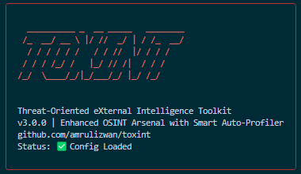

# 🔥 TOXINT v3.0.0 - Open Source Intelligence Toolkit

<div align="center">
  
  <p><strong>Threat-Oriented eXternal Intelligence Toolkit</strong></p>
  <p><em>Community-Driven OSINT Framework for Security Researchers</em></p>


</div>

## 🎯 Overview

TOXINT is a comprehensive open-source intelligence (OSINT) toolkit designed for cybersecurity professionals, penetration testers, researchers, and security investigators. This framework features **15 powerful modules** including the **Smart Auto-Profiler** with rule-based analysis and 9 comprehensive report types.

## 🆕 What's New in v3.0.0

### 🔥 Smart Auto-Profiler - Rule-Based Intelligence

- **Intelligent Analysis** - Rule-based target profiling with correlation algorithms
- **9 Report Types** - Executive, Technical, Timeline, Risk, Correlation, JSON, CSV, HTML, Comprehensive
- **Multi-Data Analysis** - Cross-reference multiple data points for complete intelligence
- **Self-Contained Architecture** - No external module dependencies, all-in-one solution
- **Pattern Recognition** - Rule-based correlation and confidence scoring

### 🛠️ Enhanced Configuration System

- **Visual Status Indicators** - Real-time configuration status in banner
- **100% Free Core Features** - Many modules work without API keys
- **Optional API Enhancement** - Premium features with API key integration

## ⚡ Complete Module Matrix

### 📋 Core OSINT Modules (13)

| ID  | Module                     | Description                    | Key Features                                  |
| --- | -------------------------- | ------------------------------ | --------------------------------------------- |
| 01  | **Domain Footprint**       | Domain enumeration & analysis  | Subdomains, WHOIS, DNS, ASN, Certificates     |
| 02  | **Username Hunter**        | Multi-platform username search | 30+ platforms, validation, profile extraction |
| 03  | **Metadata Ripper**        | File metadata extraction       | EXIF, GPS, PDF analysis, document forensics   |
| 04  | **Email Breach Scanner**   | Email security analysis        | HaveIBeenPwned, Gravatar, breach history      |
| 05  | **Website Harvester**      | Website intelligence gathering | Tech stack, metadata, admin panels            |
| 06  | **Geo Intelligence**       | Location-based analysis        | Image geolocation, coordinate extraction      |
| 07  | **Forum Crawler**          | Deep forum analysis            | Identity correlation, post history            |
| 08  | **IP Analyzer**            | IP address intelligence        | Geolocation, reputation, network analysis     |
| 09  | **People Search**          | Advanced people search         | Social mapping, identity correlation          |
| 10  | **Email Header Forensics** | Email header analysis          | Routing, authenticity, metadata               |
| 11  | **Metadata Remover**       | Metadata cleaning              | File sanitization, privacy protection         |
| 12  | **WiFi Geolocation**       | BSSID intelligence             | Network mapping, location tracking            |
| 13  | **Phone Intelligence**     | Phone number OSINT             | Carrier info, social media linking            |

### 🚀 Advanced Modules (2)

| ID  | Module                     | Description                 | Advanced Features                                                                                                                             |
| --- | -------------------------- | --------------------------- | --------------------------------------------------------------------------------------------------------------------------------------------- |
| 14  | **Hash Reversal Engine**   | Password hash cracking      | **FREE**: Offline rainbow tables, Online databases, Multi-algorithm support (MD5, SHA1, SHA256, SHA512), Dictionary attacks                   |
| 15  | **🔥 Smart Auto-Profiler** | Rule-based target profiling | **FREE**: Multi-module orchestration, 9 report types, Correlation analysis, Risk assessment, Multi-data analysis, Self-contained architecture |

## 🤖 Smart Auto-Profiler Deep Dive

### 📊 Analysis Types

1. **Comprehensive Target Profiling** - Full analysis across all available modules
2. **Domain-Focused Analysis** - Infrastructure and technology deep-dive
3. **Person-Focused Analysis** - Individual identity correlation and mapping
4. **🔥 Advanced Multi-Data Analysis** - Cross-reference multiple data points about one target

### 📋 9 Advanced Report Types

| Report Type              | Purpose                 | Content                                           |
| ------------------------ | ----------------------- | ------------------------------------------------- |
| **Executive Summary**    | Management overview     | High-level findings, risk assessment, key metrics |
| **Technical Report**     | Technical teams         | Detailed module results, execution status         |
| **Timeline Analysis**    | Chronological view      | Time-ordered events and discoveries               |
| **Risk Assessment**      | Security evaluation     | Risk scoring, threat factors, mitigation steps    |
| **Correlation Report**   | Pattern identification  | Cross-references, data relationships              |
| **JSON Export**          | Machine-readable data   | API integration, automated processing             |
| **CSV Export**           | Spreadsheet analysis    | Data manipulation, bulk analysis                  |
| **HTML Interactive**     | Web-based visualization | Interactive dashboard, charts, navigation         |
| **Comprehensive Master** | Complete documentation  | All analyses combined, full audit trail           |

### 🎯 Multi-Data Analysis Features

- **Email + Username + Domain + Phone** - Correlate multiple identities
- **Cross-Platform Validation** - Verify accounts across platforms
- **Timeline Correlation** - Chronological activity patterns
- **Confidence Scoring** - Rule-based reliability assessment
- **Pattern Recognition** - Automated relationship discovery

### 🏗️ Self-Contained Architecture

The Smart Auto-Profiler uses **rule-based analysis** (not AI/ML) with:

- **No External Dependencies** - All OSINT functions built-in
- **Async Performance** - Concurrent analysis for speed
- **Error Resilience** - Graceful failure handling
- **Rich Console Interface** - Professional progress tracking
- **Correlation Engine** - Pattern matching and data correlation
- **Confidence Algorithms** - Rule-based scoring system

## 🚀 Installation & Setup

### 📋 Prerequisites

- **Python 3.8+** (Required)
- **pip** (Python package manager)
- **Git** (For cloning repository)
- **Virtual Environment** (Recommended)

### ⚡ Quick Install (Recommended)

#### Windows Installation

```cmd
# Clone repository
git clone https://github.com/amrulizwan/toxint.git
cd toxint

# Run installer (automatically creates virtual environment)
install.bat
```

#### Linux/macOS Installation

```bash
# Clone repository
git clone https://github.com/amrulizwan/toxint.git
cd toxint

# Run installer (automatically creates virtual environment)
chmod +x install.sh
./install.sh
```

### 🔧 Manual Installation with Virtual Environment

```bash
# Clone repository
git clone https://github.com/amrulizwan/toxint.git
cd toxint

# Create virtual environment
python -m venv .venv

# Activate virtual environment
# Windows:
.venv\Scripts\activate
# Linux/macOS:
source .venv/bin/activate

# Install dependencies
pip install -r requirements.txt

# Setup configuration
cp config.env.example config.env
# Edit config.env with your API keys (optional)

# Run TOXINT
python toxint.py
```

### ⚙️ Configuration Setup

TOXINT automatically loads configuration from `config.env` file:

```bash
# Copy configuration template
cp config.env.example config.env

# Edit with your preferred editor
nano config.env  # or vim, code, notepad++, etc.
```

**Configuration Status Display:**

```
🔥 TOXINT v3.0.0 - Open Source Intelligence Toolkit 🔥
Config Status: ✅ Loaded from config.env | API Keys: 5 configured
```

## 🎮 Usage Guide

### 🔥 Interactive Mode (Recommended)

```bash
# Activate virtual environment first
source .venv/bin/activate  # Linux/macOS
# or
.venv\Scripts\activate     # Windows

# Start TOXINT interactive menu
python toxint.py

# Select module by number (01-15)
Select module (01-15) or 'q' to quit: 15

# Follow prompts for Smart Auto-Profiler
═══ SMART AUTO-PROFILER ═══
1. Comprehensive target profiling
2. Domain-focused analysis
3. Person-focused analysis
4. 🔥 Advanced Multi-Data Analysis
```

### 📋 Direct Module Access

```bash
python toxint.py domain      # Domain enumeration
python toxint.py username    # Username search
python toxint.py metadata    # Metadata extraction
python toxint.py email       # Email breach check
python toxint.py website     # Website harvesting
python toxint.py geo         # Geolocation analysis
python toxint.py forum       # Forum crawling
python toxint.py ip          # IP analysis
python toxint.py people      # People search
python toxint.py header      # Email header analysis
```

### 🔧 Configuration (Optional API Keys)

1. **HaveIBeenPwned API**: For breach checking
2. **Shodan API**: For enhanced network intelligence
3. **OpenCage/Google API**: For geolocation services
4. **VirusTotal API**: For threat intelligence
5. **AbuseIPDB API**: For IP reputation checking

## 📊 Sample Output

```text
🔥 TOXINT - Open Source Intelligence Toolkit
============================================

════ DOMAIN INTELLIGENCE REPORT ════
┌─────────────────────────────────────────────────────┐
│                  WHOIS Information                  │
├─────────────────┬───────────────────────────────────┤
│ Registrar       │ GoDaddy.com, LLC                 │
│ Creation Date   │ 2010-03-15                       │
│ Expiration Date │ 2025-03-15                       │
│ Emails          │ admin@example.com                │
└─────────────────┴───────────────────────────────────┘

┌─────────────────────────────────────────────────────┐
│               Discovered Subdomains                 │
├─────────────────────────────────────────────────────┤
│ www.example.com                                     │
│ mail.example.com                                    │
│ api.example.com                                     │
│ admin.example.com                                   │
└─────────────────────────────────────────────────────┘
```

## 🛡️ Legal Notice

**⚠️ IMPORTANT: This tool is for educational and authorized testing purposes only.**

- Only use on systems you own or have explicit permission to test
- Respect rate limits and terms of service of external APIs
- Be aware of local laws and regulations regarding OSINT activities

## 🤝 Contributing

We welcome contributions from the cybersecurity community! Here's how you can help:

### 🌟 How to Contribute

1. **Fork the repository**
2. **Create a feature branch** (`git checkout -b feature/amazing-feature`)
3. **Commit your changes** (`git commit -m 'Add amazing feature'`)
4. **Push to the branch** (`git push origin feature/amazing-feature`)
5. **Open a Pull Request**

### 🎯 Areas for Improvement

- **New OSINT Sources** - Add support for additional platforms and services
- **Enhanced Correlation** - Improve pattern recognition algorithms
- **Performance Optimization** - Speed up analysis and reduce resource usage
- **User Interface** - GUI development and improved CLI experience
- **Documentation** - Expand tutorials and usage examples
- **Bug Fixes** - Report and fix issues you encounter

### 📝 Development Guidelines

- Follow PEP 8 Python style guidelines
- Add docstrings to all functions and classes
- Include error handling and logging
- Test with multiple target types
- Update documentation for new features

## 🔮 Roadmap

### Future Enhancements

- **Enhanced Web Interface** - Browser-based dashboard
- **Plugin Architecture** - Third-party module support
- **Advanced Visualization** - Interactive graphs and timelines
- **Cloud Deployment** - Docker and cloud platform support

## 📄 License

This project is licensed under the MIT License - see the [LICENSE](LICENSE) file for details.

## ⚠️ Legal Disclaimer

TOXINT is designed for **educational and authorized security testing purposes only**.

- Users are **solely responsible** for complying with applicable laws
- Developers assume **no liability** for misuse of this tool
- Always obtain **proper authorization** before testing
- Use responsibly and ethically in the cybersecurity field

## 📞 Support & Community

- **🐛 Bug Reports**: [GitHub Issues](https://github.com/amrulizwan/toxint/issues)
- **💬 Community Support**: [GitHub Discussions](https://github.com/amrulizwan/toxint/discussions)
- **📖 Documentation**: [Wiki Pages](https://github.com/amrulizwan/toxint/wiki)
- **🔄 Updates**: [Release Notes](https://github.com/amrulizwan/toxint/releases)

## 🙏 Acknowledgments

Special thanks to:

- **OSINT Community** - For methodologies and inspiration
- **Certificate Transparency** - For transparency log access
- **ProjectDiscovery** - For Chaos subdomain dataset
- **Security Researchers** - For continuous tool improvement
- **Open Source Contributors** - For code contributions and testing

## 📊 Project Statistics

- **📦 15 Total Modules** (13 Core + 2 Advanced)
- **🌐 30+ Platforms** supported across modules
- **🔐 5 Hash Algorithms** supported in reversal engine
- **🔍 Multiple Search Engines** integrated for intelligence
- **💰 100% Free Core Tools** with optional API enhancements
- **⚡ Async Architecture** for maximum performance

---

Made with ❤️ for the cybersecurity community

🔥 Happy Hunting! 🔥
